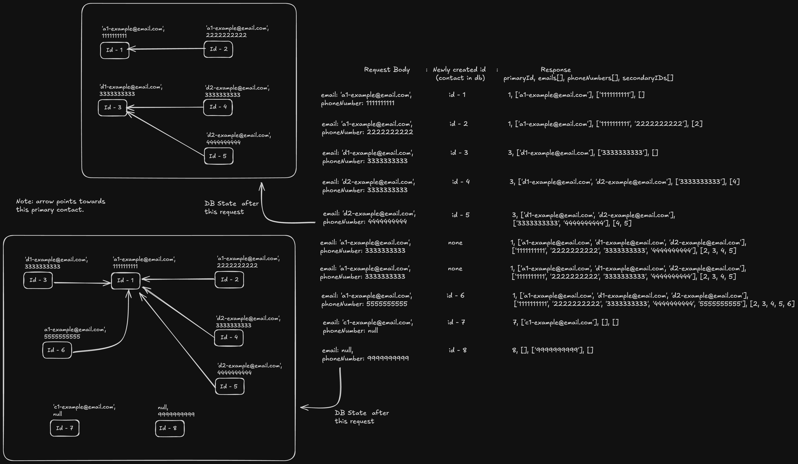

# Solution Approach: Identity Reconciliation

## Overview
The solution implements a contact identity reconciliation system that links and merges user identities based on email addresses and phone numbers. It handles cases where a user might have multiple contact records with different identifiers, establishing primary and secondary relationships between them.

## Key Architecture Components

### Data Model
- **Contact**: A model representing contact information with:
  - `id`: Unique identifier
  - `email`: Email address (optional)
  - `phoneNumber`: Phone number (optional)
  - `linkedId`: Reference to primary contact (for secondary contacts)
  - `linkPrecedence`: Status ('primary' or 'secondary')
  - `createdAt`: Timestamp when record was created

### Core Functions

1. **`identifyContactService`**
   - Main orchestration function that processes and reconciles contact identities
   - Takes email and phoneNumber as input parameters
   - Returns consolidated contact information

2. **`getOrCreatePrimaryIdOfField`**
   - Finds or creates primary contact based on specific field value (email/phoneNumber)
   - Handles the case of returning either an existing contact's ID or creating a new one

3. **`updateToSecondaryContact`**
   - Dedicated function to update a contact record as secondary
   - Updates both the target record and any of its existing secondary contacts

4. **`getContactDetailsByPK`**
   - Retrieves complete contact details by primary key
   - Throws error if contact not found

5. **`populatePrimaryContactDetails`**
   - Adds primary contact's email and phone to the consolidated contact object
   - Sets the primary contact ID in the response

6. **`populateAllSecondaryContactsDetails`**
   - Collects all unique emails, phone numbers, and secondary IDs from linked contacts
   - Ensures no duplicate values in the response arrays

## Workflow

1. **Request Processing**
   - Accept request with email and/or phoneNumber (at least one must be provided)
   - Initialize empty contact object with arrays for emails, phoneNumbers, and secondaryContactIds

2. **Primary ID Resolution**
   - Find or create primary IDs for provided email and phone number
   - This establishes which contact records we're working with

3. **Identity Reconciliation Logic**
   - **Case 1**: Both email and phone exist and point to different primary contacts
     - Compare IDs to determine which contact was created first
     - Convert newer contact to secondary status and link to the older one
     - Update all related secondary contacts to maintain proper hierarchy

   - **Case 2**: Both email and phone point to the same primary contact
     - Use existing primary contact without modifications

   - **Case 3**: Only email or only phone number exists
     - Use the respective primary contact as the basis for response

4. **Contact Data Consolidation**
   - Populate primary contact details (ID, email, phone)
   - Gather all secondary contacts linked to the primary
   - Collect unique emails and phone numbers from all related contacts
   - Create ordered arrays with primary contact values first

5. **Response Formation**
   - Return consolidated contact object with:
     - `primaryContactId`: ID of the primary contact
     - `emails`: Array of all unique email addresses (primary first)
     - `phoneNumbers`: Array of all unique phone numbers (primary first)
     - `secondaryContactIds`: Array of all secondary contact IDs

6. **Error Handling**
   - Each function implements comprehensive error handling
   - Specific error messages for easier debugging
   - Consistent error logging pattern across all functions



## Response Format

```json
{
  "contact": {
    "primaryContactId": number,
    "emails": string[],  // Primary contact email first, all emails unique
    "phoneNumbers": string[],  // Primary contact phone first, all numbers unique
    "secondaryContactIds": number[]  // Array of all secondary contact IDs
  }
}
```

## Key Implementation Details

1. **Precedence Determination**
   - Uses contact ID as a proxy for creation time (lower ID = earlier creation)
   - Primary/secondary relationship is determined by creation order

2. **Duplicate Prevention**
   - Checks for duplicates before adding emails and phone numbers
   - Ensures each identifier appears only once in the response

3. **Hierarchical Updates**
   - When converting a contact to secondary status, all its existing secondary contacts
     are also updated to maintain the correct relationship hierarchy

4. **Null Value Handling**
   - Properly handles cases where email or phone number might be null
   - Uses the nullish coalescing operator (`??`) for safe property access